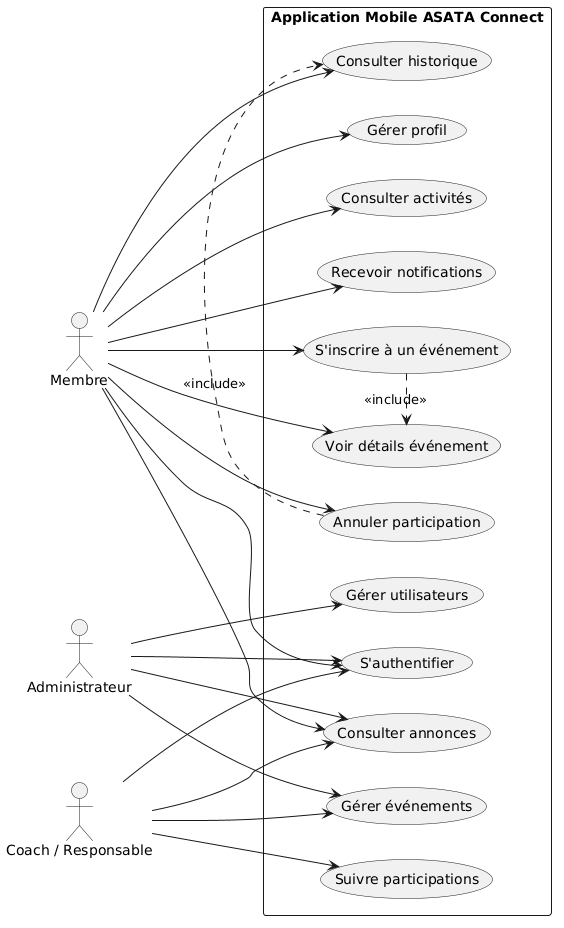
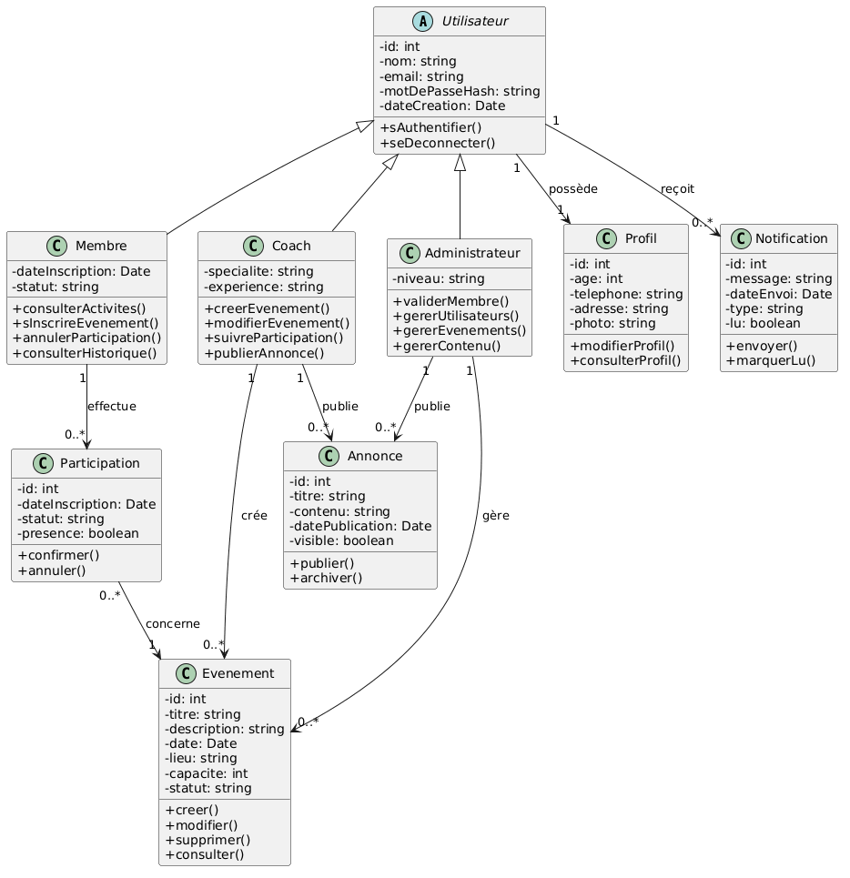
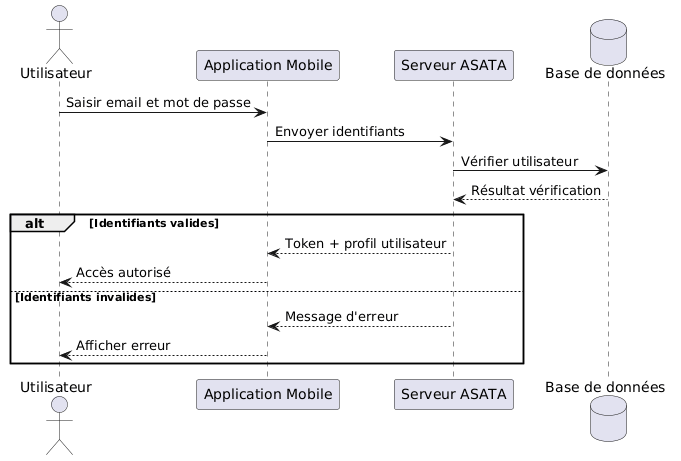
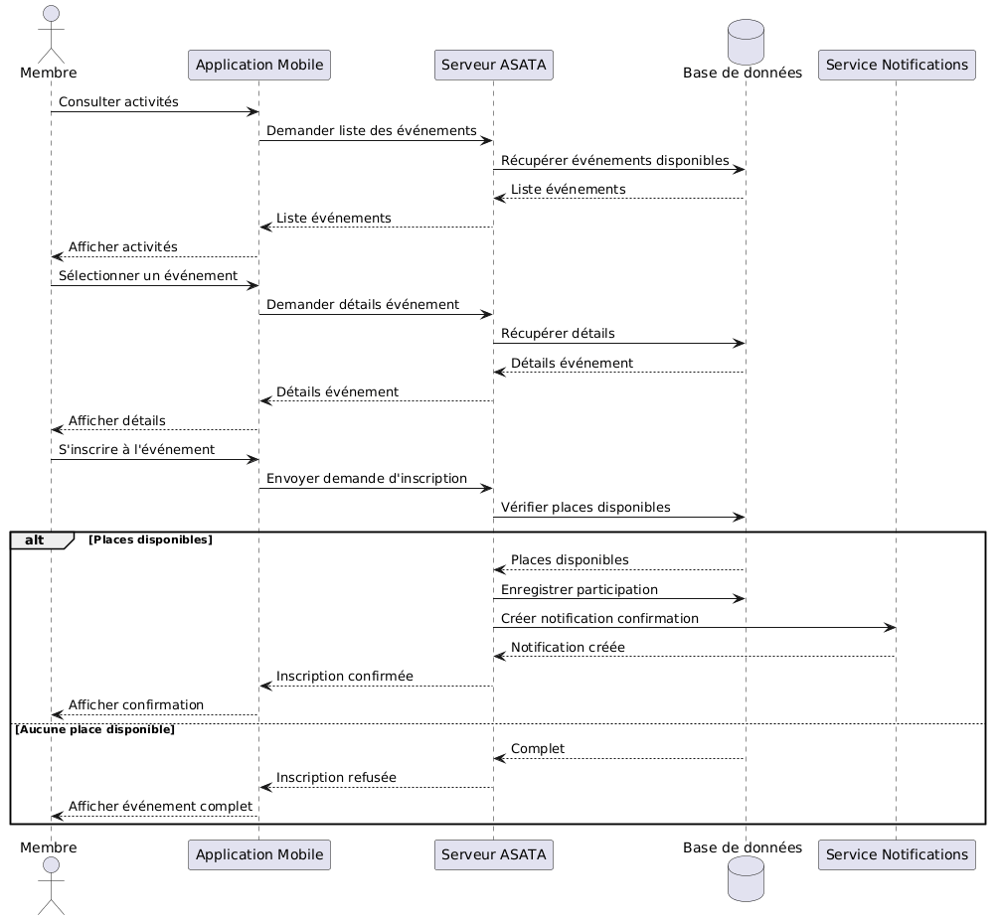
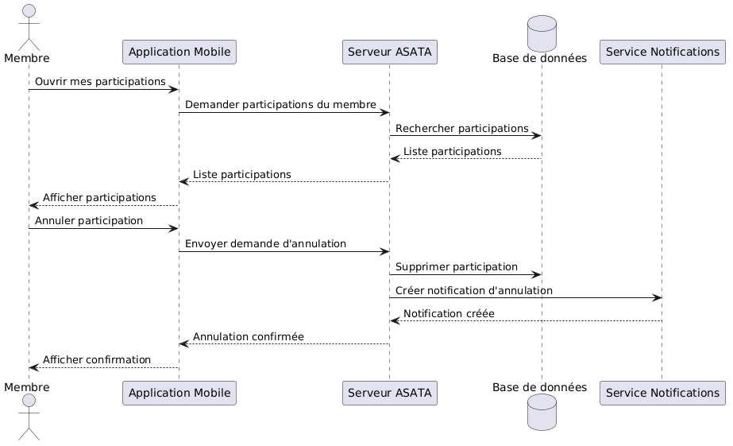
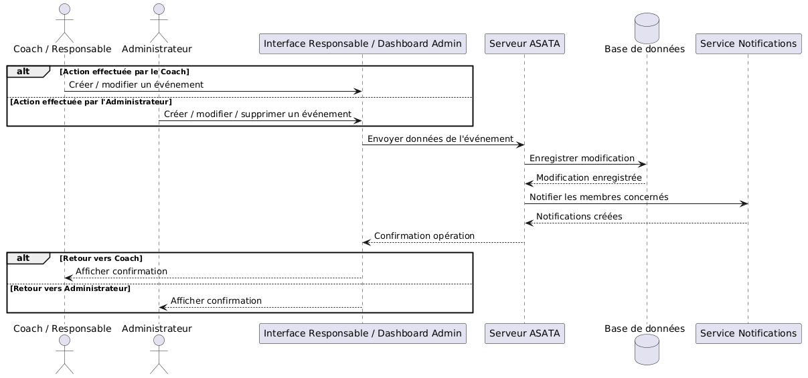
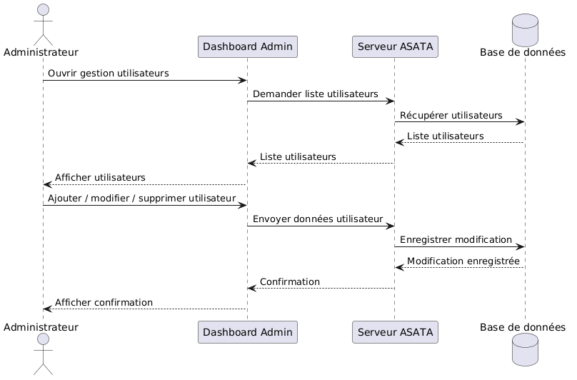

# Application Mobile — ASATA Connect

## 1. Présentation générale

ASATA Connect Mobile est l’application mobile de l’écosystème numérique ASATA. Elle complète la plateforme existante en donnant aux membres, aux coachs/responsables et aux administrateurs un point d’accès mobile aux services principaux de l’association sportive.

L’application centralise la consultation des activités, l’inscription aux événements, le suivi des participations, les annonces, les notifications et la gestion du profil. Elle permet une interaction directe entre l’association et ses adhérents, tout en s’appuyant sur une API dédiée connectée à une base de données PostgreSQL.

## 2. Objectifs de l’application mobile

Les objectifs de l’application mobile ASATA Connect sont les suivants :

- digitaliser l’interaction entre l’association et ses membres ;
- simplifier l’inscription aux événements et activités sportives ;
- centraliser les annonces et notifications importantes ;
- permettre le suivi des participations confirmées, en attente, annulées et passées ;
- offrir un accès adapté selon le rôle : membre, coach/responsable ou administrateur ;
- fournir une base évolutive pour la gestion mobile de l’association.

## 3. Acteurs de l’application

**Membre**

Le membre représente l’utilisateur principal de l’application. Il peut créer un compte, se connecter, consulter son profil, parcourir les activités, consulter le détail d’un événement, s’inscrire, annuler une participation, consulter son historique, lire les annonces et suivre ses notifications.

**Coach / Responsable**

Le coach ou responsable intervient dans le suivi opérationnel des activités. Son accès lui permet de suivre les participations, d’encadrer les événements associés à son périmètre et de contribuer à la communication autour des activités. Dans le modèle de rôles, cet acteur correspond au rôle `coach`.

**Administrateur**

L’administrateur supervise le système mobile. Il dispose d’un accès de gestion pour les utilisateurs, les événements, les annonces et les contenus opérationnels. Son rôle permet également de contrôler les données de référence et de garantir la cohérence globale de l’information diffusée aux membres.

## 4. Architecture générale de la solution mobile

La solution mobile suit une architecture client-serveur organisée autour d’un accès applicatif par rôle. Le client mobile est situé dans `apps/mobile` et l’API mobile dans `apps/mobile-api`. L’application Expo/React Native communique avec l’API Express/TypeScript au moyen de requêtes JSON sécurisées par un jeton JWT. L’API applique la validation, les règles métier et l’accès aux données à travers Prisma ORM, puis persiste les données dans PostgreSQL.

L’application mobile regroupe trois espaces fonctionnels : l’espace membre pour l’interaction avec les activités et les communications, l’espace coach/responsable pour le suivi opérationnel des événements et des participations, et l’espace administrateur pour la supervision des utilisateurs, des événements et des contenus. Cette organisation permet de conserver une même application mobile tout en adaptant les écrans, les actions et les droits selon le rôle authentifié.

```text
+---------------------------------------------------------------+
|                 Distribution mobile                            |
|                 Expo EAS Build                                 |
|                 APK / AAB / iOS build                          |
+-------------------------------+-------------------------------+
                                |
                                v
+---------------------------------------------------------------+
| Application Mobile ASATA Connect                               |
| apps/mobile                                                     |
| Expo, React Native, TypeScript, React Navigation, Zustand       |
| Espaces : Membre | Coach / Responsable | Administrateur         |
+-------------------------------+-------------------------------+
                                |
                                | HTTPS / JSON
                                | Authorization: Bearer JWT
                                v
+---------------------------------------------------------------+
| API Mobile ASATA Connect                                       |
| apps/mobile-api                                                 |
| Node.js, Express, TypeScript, Zod, JWT, bcryptjs, CORS, limiter |
| Auth, Profile, Events, Participations, Announcements,           |
| Notifications, Admin Users, Admin Events, Admin Content,        |
| Coach Participation Tracking                                    |
+-------------------------------+-------------------------------+
                                |
                                | Prisma Client / Prisma ORM
                                v
+---------------------------------------------------------------+
| Base de données PostgreSQL                                     |
| User, Profil, Evenement, Participation, Annonce, Notification   |
+-------------------------------+-------------------------------+
                                ^
                                |
+---------------------------------------------------------------+
| Services externes                                              |
| EAS Build pour la distribution mobile                           |
| Service médias externe pour les URI/URL de photos et images     |
+---------------------------------------------------------------+
```

Les médias sont référencés dans les données applicatives par des champs tels que `photo` dans `Profil` et `coverImage` dans `Evenement`. Le stockage binaire peut être externalisé par l’environnement de déploiement, tandis que la base PostgreSQL conserve les références nécessaires à l’affichage mobile.

## 5. Architecture du frontend mobile

Le frontend mobile est une application Expo construite avec React Native et TypeScript. L’entrée principale `App.tsx` hydrate l’état d’authentification, affiche un indicateur de chargement pendant la récupération locale des informations et monte ensuite le conteneur de navigation.

Le système de navigation est organisé avec React Navigation :

- `RootNavigator.tsx` choisit entre le parcours d’authentification et l’espace principal selon l’état `isAuthenticated` ;
- `AuthNavigator.tsx` regroupe les écrans `Login`, `Register` et `ForgotPassword` dans une navigation native stack ;
- `MainNavigator.tsx` définit la navigation principale par onglets : `Accueil`, `Activites`, `Participations`, `Annonces` et `Profil` ;
- les piles internes gèrent les détails : détail événement, notifications, détail annonce et édition du profil.

La navigation est également conçue selon le rôle retourné par l’authentification. Un membre accède aux écrans de consultation, d’inscription, de participation, d’annonces, de notifications et de profil. Un coach ou responsable accède aux écrans de suivi opérationnel, notamment la consultation des participants, le suivi des présences et le contrôle de l’état des activités. Un administrateur accède aux écrans d’administration pour les utilisateurs, les événements, les annonces et la supervision globale. Ces groupes d’écrans sont décrits au niveau fonctionnel afin de représenter l’expérience mobile complète, sans ajouter de chemins de fichiers qui ne figurent pas dans l’arborescence actuelle.

La couche de communication avec l’API est centralisée dans `src/api/client.ts`. Elle construit les requêtes HTTP, ajoute l’en-tête `Authorization: Bearer <token>` lorsque le jeton est disponible et normalise les erreurs API. Les services fonctionnels placés dans `src/services` isolent les appels liés à l’authentification, aux événements, aux participations, aux annonces et aux notifications.

La gestion d’état repose sur Zustand. Le store `auth.store.ts` conserve l’utilisateur, le token, l’état de chargement et l’état d’authentification. Les données d’authentification sont persistées localement avec AsyncStorage via `src/utils/storage.ts`, sous les clés `asata_token` et `asata_user`. Le store `notifications.store.ts` maintient le compteur de notifications non lues utilisé par le badge de navigation.

Les composants réutilisables sont regroupés dans `src/components`. Ils fournissent les éléments communs d’interface (`Button`, `Input`, `Card`, `Badge`, `Avatar`, `AppHeader`, `EmptyState`, `ErrorMessage`, `LoadingSpinner`) et les composants métier (`EventCard`, `CapacityBar`, `NotificationItem`, `ParticipationItem`).

Le design mobile s’appuie sur les maquettes Google Stitch disponibles dans `docs/mobile UI kit design (stitch)`. Ces fichiers ont servi de référence pour la structure des écrans, l’espacement, la hiérarchie visuelle, les cartes, les boutons, les badges et la navigation inférieure. Les maquettes couvrent les écrans membres ainsi que l’expérience mobile d’administration : tableau de bord, gestion des événements, annuaire des membres et gestion des annonces.

Structure principale du client mobile :

```text
apps/mobile
├── App.tsx
├── app.json
├── index.ts
├── package.json
├── assets
│   ├── adaptive-icon.png
│   ├── favicon.png
│   ├── icon.png
│   ├── splash-icon.png
│   └── images
│       ├── logo.png
│       └── placeholder-event.png
└── src
    ├── api
    │   └── client.ts
    ├── components
    │   ├── common
    │   ├── events
    │   ├── notifications
    │   └── participations
    ├── constants
    │   ├── colors.ts
    │   ├── spacing.ts
    │   └── typography.ts
    ├── hooks
    │   ├── useAuth.ts
    │   ├── useEvents.ts
    │   ├── useNotifications.ts
    │   └── useParticipations.ts
    ├── mocks
    ├── navigation
    │   ├── AuthNavigator.tsx
    │   ├── MainNavigator.tsx
    │   └── RootNavigator.tsx
    ├── screens
    │   ├── announcements
    │   ├── auth
    │   ├── events
    │   ├── home
    │   ├── notifications
    │   ├── participations
    │   └── profile
    ├── services
    │   ├── announcements.service.ts
    │   ├── auth.service.ts
    │   ├── events.service.ts
    │   ├── notifications.service.ts
    │   └── participations.service.ts
    ├── store
    │   ├── auth.store.ts
    │   └── notifications.store.ts
    ├── types
    │   └── index.ts
    └── utils
        ├── date.ts
        ├── storage.ts
        └── validators.ts
```

## 6. Architecture du backend mobile

Le backend mobile est une API Node.js construite avec Express et TypeScript. Le fichier `src/main.ts` initialise la connexion Prisma, démarre le serveur sur le port configuré et gère l’arrêt propre de l’application. Le fichier `src/app.ts` configure les middlewares globaux, le CORS, le rate limiting, le parsing JSON, la route de santé `/health` et les modules fonctionnels sous `/api`.

Les routes sont organisées par domaine :

- `/api/auth` : inscription, connexion, récupération de l’utilisateur courant et déconnexion ;
- `/api/events` : liste des événements, détail événement et vérification d’inscription ;
- `/api/participations` : participations de l’utilisateur, inscription et annulation ;
- `/api/announcements` : liste et détail des annonces visibles ;
- `/api/notifications` : liste des notifications, marquage individuel et marquage global comme lu ;
- `/api/profile` : mise à jour du profil de l’utilisateur connecté.

Au niveau fonctionnel, l’API mobile couvre également les responsabilités d’administration et de suivi : gestion des utilisateurs, gestion des rôles, gestion des événements, gestion des annonces et contenus, consultation des listes de participants, suivi des présences et supervision des données associatives. Ces responsabilités s’appuient sur les mêmes modèles de données et sur des routes protégées, avec une séparation logique entre les opérations membres, coachs/responsables et administrateurs.

Les schémas Zod valident les entrées avant l’exécution des services. Le middleware `authenticate` vérifie le jeton JWT transmis dans l’en-tête `Authorization`. Le middleware `requireRole` fournit la base du contrôle d’accès par rôle : les actions d’administration sont réservées au rôle `administrateur`, tandis que les actions de suivi opérationnel sont ouvertes aux rôles `coach` et `administrateur` selon leur périmètre. Les mots de passe sont hachés avec `bcryptjs` avant persistance. Prisma Client assure l’accès à PostgreSQL.

Structure principale de l’API mobile :

```text
apps/mobile-api
├── package.json
├── tsconfig.json
├── prisma
│   ├── schema.prisma
│   ├── seed.ts
│   └── migrations
└── src
    ├── app.ts
    ├── main.ts
    ├── config
    │   ├── database.ts
    │   └── env.ts
    ├── middleware
    │   ├── auth.middleware.ts
    │   └── error.middleware.ts
    ├── modules
    │   ├── announcements
    │   ├── auth
    │   ├── events
    │   ├── notifications
    │   ├── participations
    │   └── profile
    └── utils
        ├── jwt.ts
        └── response.ts
```

## 7. Stack technique de l’application mobile

| Technologie | Rôle | Justification |
|---|---|---|
| Expo `~54.0.33` | Plateforme de développement et build mobile | Simplifie l’exécution locale, les builds Android/iOS et l’intégration de modules natifs. |
| React Native `0.81.5` | Interface mobile native | Permet de construire une application mobile multiplateforme à partir de composants React. |
| React `19.1.0` | Bibliothèque UI | Fournit le modèle de composants, d’état local et de rendu utilisé par l’application. |
| TypeScript `~5.9.2` | Typage statique | Sécurise les modèles de données, les paramètres de navigation et les services API. |
| React Navigation `@react-navigation/native` | Navigation applicative | Structure les parcours d’authentification, les onglets et les écrans de détail. |
| `@react-navigation/native-stack` | Navigation stack native | Gère les transitions entre écrans dans les sections Auth, Events, Announcements et Profile. |
| `@react-navigation/bottom-tabs` | Navigation par onglets | Organise les accès principaux : accueil, activités, participations, annonces et profil. |
| Zustand `^5.0.12` | Gestion d’état globale | Centralise l’authentification et le compteur de notifications avec une API légère. |
| AsyncStorage `2.2.0` | Persistance locale | Conserve localement le token JWT et les informations utilisateur entre les sessions. |
| Expo Image Picker `~17.0.10` | Sélection d’image | Permet la sélection d’une photo de profil depuis la galerie du téléphone. |
| Expo Font `~14.0.11` | Chargement de polices | Supporte l’identité visuelle et l’intégration typographique de l’application. |
| Expo Status Bar `~3.0.9` | Gestion de la barre système | Harmonise l’apparence de la barre de statut avec le thème mobile. |
| React Native Safe Area Context `~5.6.0` | Zones sûres | Protège les contenus contre les encoches et barres système. |
| React Native Screens `~4.16.0` | Optimisation navigation | Améliore les performances des écrans React Navigation. |
| `@expo/vector-icons` `^15.0.3` | Iconographie | Fournit les icônes Feather utilisées dans la navigation, les cartes et les actions. |
| React Native Web `^0.21.0` et React DOM `19.1.0` | Cible web Expo | Permet l’exécution de l’application sur cible web pendant les vérifications. |

## 8. Stack technique de l’API mobile

| Technologie | Rôle | Justification |
|---|---|---|
| Node.js | Runtime backend | Exécute l’API mobile et son serveur HTTP. |
| Express `^5.2.1` | Framework API REST | Organise les routes, middlewares et réponses JSON. |
| TypeScript `^6.0.3` | Typage backend | Renforce la cohérence des services, payloads et middlewares. |
| Prisma `^6.19.3` | ORM et migrations | Modélise les entités, génère Prisma Client et structure l’accès PostgreSQL. |
| `@prisma/client` `^6.19.3` | Client base de données | Exécute les requêtes typées vers PostgreSQL. |
| PostgreSQL | Base de données relationnelle | Stocke les utilisateurs, profils, événements, participations, annonces et notifications. |
| JSON Web Token `jsonwebtoken` `^9.0.3` | Authentification stateless | Génère et vérifie les tokens JWT utilisés par les routes protégées. |
| `bcryptjs` `^3.0.3` | Hachage de mot de passe | Protège les mots de passe par hachage avant stockage. |
| Zod `^4.4.3` | Validation des entrées | Valide les corps de requêtes, paramètres et variables d’environnement. |
| CORS `^2.8.6` | Contrôle des origines | Limite les origines autorisées à communiquer avec l’API. |
| `express-rate-limit` `^8.5.0` | Limitation de débit | Protège l’API contre les abus et les tentatives répétées. |
| dotenv `^17.4.2` | Variables d’environnement | Charge la configuration sensible sans l’inscrire dans le code. |
| `ts-node-dev` `^2.0.0` | Développement local | Permet le redémarrage automatique du serveur en phase de développement. |

## 9. Modèle de données

Le modèle de données réel est défini dans `apps/mobile-api/prisma/schema.prisma`. Les modèles Prisma sont `User`, `Profil`, `Evenement`, `Participation`, `Annonce` et `Notification`.

Le modèle `User` est le point central du système de comptes. Il ne crée pas de table séparée pour les administrateurs ou les coachs : la distinction entre les accès se fait par le champ `role`. Un administrateur est donc représenté par `User.role = administrateur`, un coach/responsable par `User.role = coach` et un membre par `User.role = membre`. Les actions d’administration et de suivi opérationnel agissent sur les modèles existants : `User`, `Profil`, `Evenement`, `Participation`, `Annonce` et `Notification`.

**User**

`User` représente un compte applicatif. Il contient l’identité (`nom`, `email`), le mot de passe haché (`motDePasseHash`), le rôle (`role`), la date de création et des champs spécialisés selon le profil métier. Pour les membres, `dateInscription` et `statut` décrivent l’adhésion. Pour les coachs, `specialite` et `experience` caractérisent le responsable. Pour les administrateurs, `niveau` indique le niveau d’administration. Un utilisateur possède un `Profil`, plusieurs `Participation` et plusieurs `Notification`.

**Profil**

`Profil` contient les informations personnelles complémentaires : `age`, `telephone`, `adresse` et `photo`. Il est relié à `User` par une relation un-à-un via `userId`, avec suppression en cascade.

**Evenement**

`Evenement` modélise une activité ou un événement sportif. Il contient `titre`, `description`, `date`, `lieu`, `capacite`, `statut` et `coverImage`. Un événement possède plusieurs participations. Les index sur `statut` et `date` facilitent la consultation chronologique et le filtrage. Au niveau métier, les coachs/responsables et les administrateurs assurent la gestion et le suivi des événements, sans nécessiter de champ de propriété supplémentaire dans le schéma actuel.

**Participation**

`Participation` relie un `User` à un `Evenement`. Elle stocke `dateInscription`, `statut` et `presence`. La contrainte unique `@@unique([userId, evenementId])` empêche une double inscription au même événement pour un même utilisateur. Les suppressions de l’utilisateur ou de l’événement entraînent la suppression des participations associées. Les participations constituent également la base du suivi coach/administrateur : consultation des inscrits, suivi des statuts et contrôle de la présence.

**Annonce**

`Annonce` représente une communication publiée par l’association. Elle contient `titre`, `contenu`, `datePublication` et `visible`. Les annonces visibles sont affichées dans l’application mobile et triées par date de publication. La création et la gestion des annonces relèvent de la responsabilité administrateur ou des responsables autorisés au niveau métier.

**Notification**

`Notification` stocke les messages envoyés à un utilisateur. Elle contient `message`, `dateEnvoi`, `type` et `lu`. La relation avec `User` permet d’afficher une liste personnelle de notifications et de gérer l’état lu/non lu. Les notifications sont générées après les actions clés : inscription, annulation, annonce ou rappel opérationnel.

Le schéma utilise des champs `String` pour les valeurs de classification. Les valeurs métier utilisées par le système sont :

- `role` : `membre`, `coach`, `administrateur` ;
- statut utilisateur : `actif`, `inactif`, `suspendu` ;
- statut événement : `planifie`, `en_cours`, `termine`, `annule` ;
- statut participation : `confirme`, `annule`, `en_attente` ;
- présence : `present`, `absent`, `non_renseigne` ;
- type notification : `event_confirmation`, `event_cancelled`, `announcement`, `reminder`.

## 10. Authentification et gestion des rôles

L’authentification repose sur un flux JWT. Lors de la création de compte, l’utilisateur transmet son nom, son email, son mot de passe et éventuellement son téléphone. L’API valide les données avec Zod, normalise l’email, vérifie son unicité, hache le mot de passe avec `bcryptjs` et crée un compte membre actif avec un profil associé.

Lors de la connexion, l’API vérifie l’existence de l’utilisateur et compare le mot de passe avec le hash enregistré. En cas de succès, elle génère un token JWT contenant `userId`, `email` et `role`. Le client mobile stocke le token et l’utilisateur dans AsyncStorage. À chaque démarrage, `hydrate()` restaure ces informations pour reconnecter l’utilisateur localement.

Après authentification, le rôle devient un paramètre de navigation et d’autorisation. Un membre est dirigé vers l’espace membre et ne peut pas accéder aux opérations administratives. Un coach ou responsable accède aux écrans de suivi opérationnel : événements, participants, présences et appui à la communication. Un administrateur accède aux écrans de supervision et de gestion : utilisateurs, rôles, événements, annonces et contenus.

Les routes protégées utilisent le middleware `authenticate`, qui exige un en-tête `Authorization: Bearer <token>`. Les accès différenciés par rôle s’appuient sur `requireRole`, qui autorise uniquement les rôles nécessaires à l’action demandée. Les actions sensibles de gestion sont donc isolées des accès membres, tandis que les droits coach/responsable et administrateur sont contrôlés côté API avant toute modification de données.

## 11. Fonctionnalités principales

### 11.1 Authentification

Le parcours d’authentification comprend la connexion, l’inscription et la déconnexion. L’inscription crée un compte `membre`, enregistre le profil associé et retourne un token JWT. La connexion retourne le même format de réponse avec le token et l’utilisateur. La déconnexion supprime localement `asata_token` et `asata_user`, puis replace l’utilisateur dans le parcours d’authentification.

### 11.2 Gestion du profil

Le profil affiche les informations principales de l’utilisateur : nom, email, rôle, téléphone, localisation et photo. L’écran d’édition permet de modifier les informations personnelles et de sélectionner une image avec Expo Image Picker. Les modifications sont transmises à l’API via `/api/profile/me`, puis l’état utilisateur local est actualisé.

### 11.3 Consultation des activités

L’application affiche la liste des événements depuis `/api/events`. Les activités peuvent être filtrées par statut : tous, à venir, terminés et annulés. Chaque événement présente son titre, sa date, son lieu, sa capacité, son nombre d’inscrits et son statut. Le détail événement affiche la description, la capacité, le niveau de remplissage et les actions d’inscription ou d’annulation selon l’état courant.

### 11.4 Inscription à un événement

Le membre sélectionne un événement depuis la liste ou l’accueil, puis déclenche l’inscription depuis le détail. L’API vérifie l’existence de l’événement, son statut, l’absence d’inscription active pour le même membre et la capacité disponible. Une participation est ensuite créée avec le statut `confirme` et la présence `non_renseigne`. Une notification de type `event_confirmation` est générée pour confirmer l’inscription.

### 11.5 Annulation de participation

Le membre accède à ses participations depuis l’onglet dédié ou depuis le détail événement. Après confirmation, l’application appelle l’API d’annulation. Le backend vérifie que la participation appartient à l’utilisateur connecté, met son statut à `annule` et génère une notification de type `event_cancelled`.

### 11.6 Historique des participations

Les participations de l’utilisateur sont chargées depuis `/api/participations/me` et triées par date d’inscription décroissante. L’interface les organise en sections : confirmées, en attente, annulées et passées. Cette organisation donne au membre une vision claire de ses activités courantes et de son historique.

### 11.7 Annonces

Les annonces visibles sont récupérées depuis `/api/announcements`. La liste affiche les communications publiées par l’association et permet d’ouvrir un détail d’annonce. Le backend filtre les annonces par `visible: true` et les trie par `datePublication` décroissante.

### 11.8 Notifications

Les notifications personnelles sont récupérées depuis `/api/notifications/me`. L’écran distingue les notifications non lues et lues. L’utilisateur peut marquer une notification comme lue via `/api/notifications/:id/read` ou marquer toutes les notifications comme lues via `/api/notifications/me/read-all`. Le nombre de notifications non lues est synchronisé dans Zustand et affiché dans la navigation.

### 11.9 Accès Coach / Responsable

L’accès coach/responsable permet le suivi opérationnel des activités. Le responsable consulte les événements dont il assure l’encadrement, suit leur état, vérifie la liste des participants et contrôle les statuts de participation. Le suivi de présence s’appuie sur le champ `presence` de `Participation`, ce qui permet d’identifier les membres présents, absents ou non renseignés.

Cet espace donne également une vision de terrain : capacité restante, nombre d’inscrits, événements en cours, événements annulés et historique des participations. Le coach/responsable peut contribuer à la communication opérationnelle en s’appuyant sur les annonces et notifications liées aux événements. Les actions sensibles sont contrôlées par le rôle `coach` et par les règles d’accès de l’API.

### 11.10 Accès Administrateur

L’accès administrateur couvre la supervision complète de l’application mobile. L’administrateur gère les utilisateurs, les profils, les rôles, les événements, les annonces et les contenus de communication. Il contrôle la qualité des données associatives, vérifie les informations de référence et garantit la cohérence des informations diffusées aux membres.

L’espace administrateur comprend un tableau de bord de supervision, une gestion des membres, une gestion des événements et une gestion des annonces. Les maquettes Stitch d’administration représentent cette expérience mobile avec quatre écrans structurants : `admin_dashboard`, `admin_event_management`, `member_directory` et `announcement_management`. Ces écrans matérialisent la supervision globale, le contrôle des activités, l’annuaire des membres et la gestion du contenu institutionnel.

## 12. Flux fonctionnels

**Flux d’authentification**

1. L’utilisateur saisit son email et son mot de passe.
2. L’application envoie les identifiants à `/api/auth/login`.
3. L’API valide la requête avec Zod.
4. L’API recherche l’utilisateur par email.
5. `bcryptjs` compare le mot de passe saisi avec le hash stocké.
6. L’API génère un JWT contenant l’identifiant, l’email et le rôle.
7. Le client stocke le token et l’utilisateur dans AsyncStorage.
8. `RootNavigator` affiche l’espace principal authentifié.

**Flux d’inscription à un événement**

1. Le membre consulte la liste des événements.
2. Il ouvre le détail d’un événement.
3. L’application vérifie si l’utilisateur est déjà inscrit.
4. Le membre déclenche l’action d’inscription.
5. L’API vérifie le statut de l’événement, la capacité et l’unicité de la participation.
6. L’API crée une ligne `Participation`.
7. L’API crée une `Notification` de confirmation.
8. L’application met à jour l’état d’inscription et le compteur d’inscrits.

**Flux d’annulation de participation**

1. Le membre ouvre ses participations ou le détail d’un événement.
2. Il choisit l’action d’annulation.
3. L’application demande une confirmation.
4. L’API vérifie que la participation appartient à l’utilisateur connecté.
5. L’API met le statut de la participation à `annule`.
6. L’API crée une notification d’annulation.
7. L’application recharge la liste des participations.

**Flux de notification**

1. L’application récupère les notifications de l’utilisateur connecté.
2. Le hook `useNotifications` calcule le nombre de notifications non lues.
3. Le store `notifications.store.ts` met à jour le badge.
4. L’utilisateur ouvre l’écran Notifications.
5. Il marque une notification comme lue ou toutes les notifications comme lues.
6. L’API met à jour le champ `lu`.
7. L’application recharge les notifications et synchronise le badge.

**Flux de gestion des utilisateurs par l’administrateur**

1. L’administrateur accède au tableau de bord de gestion.
2. L’interface demande la liste des utilisateurs à la couche API.
3. L’API vérifie le token JWT et le rôle `administrateur`.
4. L’API récupère les comptes `User` et les profils associés.
5. L’administrateur consulte l’annuaire, contrôle les informations et modifie les données nécessaires.
6. L’API valide les entrées, applique l’opération et persiste la modification dans PostgreSQL.
7. L’interface affiche la confirmation de l’opération et actualise la liste.

**Flux de gestion des événements par l’administrateur**

1. L’administrateur ouvre l’écran de gestion des événements.
2. L’interface charge la liste des `Evenement` avec leurs informations de capacité et de statut.
3. L’administrateur crée, modifie, annule ou contrôle un événement.
4. L’API vérifie le rôle `administrateur` et valide les données reçues.
5. Prisma enregistre les modifications dans PostgreSQL.
6. Les membres concernés reçoivent les notifications associées lorsque l’action l’exige.
7. L’interface affiche l’état final de l’événement.

**Flux de gestion des annonces par l’administrateur**

1. L’administrateur ouvre l’écran de gestion des annonces.
2. L’interface demande les contenus publiés ou préparés à la couche API.
3. L’API vérifie le rôle `administrateur`.
4. L’administrateur crée, modifie, rend visible ou archive une annonce.
5. L’API valide les données de l’annonce et met à jour le modèle `Annonce`.
6. Les notifications de type `announcement` sont associées aux utilisateurs concernés lorsque la communication le nécessite.
7. L’application mobile affiche les annonces visibles dans l’espace membre.

**Flux de suivi des participations par le coach / responsable**

1. Le coach/responsable ouvre l’espace de suivi opérationnel.
2. L’interface charge les événements et les participations associées.
3. L’API vérifie le token JWT et le rôle `coach` ou `administrateur`.
4. Le coach consulte la liste des participants, les statuts d’inscription et les informations de présence.
5. Le coach met à jour le suivi opérationnel de l’activité selon les données observées.
6. L’API persiste les changements autorisés sur les participations.
7. L’interface actualise les compteurs, les statuts et les informations de suivi.

**Flux de gestion des événements par le coach ou l’administrateur**

1. Le coach/responsable ou l’administrateur ouvre l’espace de gestion des événements.
2. L’interface transmet les données de création ou modification à l’API.
3. L’API vérifie le rôle et valide les entrées.
4. Prisma enregistre les modifications dans PostgreSQL.
5. Les membres concernés reçoivent les notifications associées.
6. L’interface affiche l’état final de l’opération.

## 13. UML de l’application mobile

Les diagrammes PlantUML sont disponibles dans `docs/UML`. Ils documentent les acteurs, les entités principales et les flux métier de l’application mobile.

| Diagramme | Fichier source | Rôle dans la documentation |
|---|---|---|
| Diagramme de cas d’utilisation | `docs/UML/Use Case Diagram.puml` | Présente les acteurs `Membre`, `Coach / Responsable` et `Administrateur`, ainsi que leurs interactions principales avec l’application mobile. |
| Diagramme de classes | `docs/UML/Class Diagram.puml` | Décrit les classes métier : utilisateur, membre, coach, administrateur, profil, événement, participation, annonce et notification. |
| Séquence Authentification | `docs/UML/Sequence Diagrams/Authentification.puml` | Décrit la saisie des identifiants, la vérification côté serveur et le retour du token/profil. |
| Séquence Inscription événement | `docs/UML/Sequence Diagrams/InscriptionEvent.puml` | Décrit la consultation des activités, le choix d’un événement, la vérification de capacité, la création de participation et la notification. |
| Séquence Annulation participation | `docs/UML/Sequence Diagrams/CancelParticipation.puml` | Décrit la consultation des participations, la demande d’annulation, la mise à jour de la participation et la notification. |
| Séquence Gestion événements | `docs/UML/Sequence Diagrams/EventsManagement(Coach-Admin).puml` | Décrit l’intervention du coach ou de l’administrateur dans la création, modification ou suppression d’événements. |
| Séquence Gestion utilisateurs | `docs/UML/Sequence Diagrams/UsersManagement(Admin).puml` | Décrit la consultation et la modification des utilisateurs par l’administrateur. |















## 14. Interface utilisateur et maquettes Stitch

Les maquettes de l’interface mobile sont fournies dans `docs/mobile UI kit design (stitch)`. Elles proviennent de Google Stitch et constituent la base visuelle du client Expo/React Native. Les fichiers HTML générés par Stitch ont servi de références pour la structure des écrans, l’espacement, la hiérarchie visuelle, les cartes, les composants de navigation, les boutons, les badges et les listes.

La direction graphique `Athletic Precision` définit une identité institutionnelle sportive : palette bleu profond, accent bleu clair, surfaces claires, typographie Lexend, grille mobile fluide, cartes structurées et iconographie Feather. Cette approche correspond à une application associative professionnelle, lisible et orientée action.

**Écrans membre**


**Écrans administrateur et responsable**

Les écrans administrateur définissent l’expérience mobile de gestion : le tableau de bord donne une synthèse de supervision, la gestion des événements regroupe les actions sur les activités, l’annuaire des membres structure la consultation des utilisateurs, et la gestion des annonces centralise les contenus de communication. Les fichiers HTML générés par Stitch restent les références UI d’autorité lorsque la capture statique ne restitue pas intégralement le contenu rendu.


## 15. Sécurité

La sécurité de la solution mobile repose sur plusieurs mécanismes complémentaires :

- authentification JWT avec génération de token côté API et transmission par en-tête `Authorization` ;
- stockage local du token dans AsyncStorage côté mobile ;
- hachage des mots de passe avec `bcryptjs` avant persistance ;
- validation des entrées avec Zod pour l’authentification, le profil, les événements, les participations et les paramètres ;
- CORS configuré à partir de `ALLOWED_ORIGINS` pour contrôler les origines autorisées ;
- limitation globale de débit sur `/api` avec `RATE_LIMIT_MAX` ;
- limitation spécifique sur `/api/auth` pour réduire les tentatives répétées de connexion ;
- contrôle d’accès par rôle avec `authenticate` et `requireRole` ;
- accès à PostgreSQL exclusivement par Prisma Client ;
- configuration sensible par variables d’environnement : `DATABASE_URL`, `DIRECT_URL`, `JWT_SECRET`, `JWT_EXPIRES_IN`, `ALLOWED_ORIGINS`, `RATE_LIMIT_MAX`, `PORT` et `NODE_ENV`.

En production, la communication API s’effectue en HTTPS, le secret JWT reste dans l’environnement serveur et les accès à la base de données sont fournis par une chaîne de connexion PostgreSQL sécurisée.

## 16. Déploiement, build et distribution mobile

La distribution mobile s’appuie sur Expo EAS Build. Les builds Android sont générés sous forme APK ou AAB pour la distribution interne et la préparation à une publication contrôlée. Les builds iOS sont produits par EAS Build et distribués via le circuit interne Apple/TestFlight lorsque la cible iOS est utilisée.

L’intégration continue s’appuie sur un workflow GitHub Actions pour automatiser les vérifications, l’installation des dépendances et les commandes de build. La séparation entre `apps/mobile` et `apps/mobile-api` permet d’exécuter indépendamment les contrôles du client mobile et de l’API.

L’API mobile est déployée sur une plateforme cloud compatible Node.js, par exemple Railway ou Render. Elle expose les endpoints `/health` et `/api/*`, se connecte à PostgreSQL au moyen de `DATABASE_URL` et utilise les variables d’environnement pour la sécurité, le CORS et le rate limiting.

Côté mobile, `API_BASE_URL` distingue l’environnement de développement local et l’environnement de production. En développement, l’application cible l’hôte et le port API accessibles depuis le réseau local. En production, l’URL de l’API mobile est configurée comme URL de production via la configuration applicative.

Variables de configuration principales :

- mobile : `API_BASE_URL`, hôte API de développement, port API de développement, URL de production API ;
- API : `NODE_ENV`, `PORT`, `DATABASE_URL`, `DIRECT_URL`, `JWT_SECRET`, `JWT_EXPIRES_IN`, `ALLOWED_ORIGINS`, `RATE_LIMIT_MAX` ;
- base de données : chaîne de connexion PostgreSQL et accès direct pour Prisma lorsque l’environnement l’utilise.

## 17. Tests et validation

La validation de la solution mobile couvre le client, l’API et l’intégration base de données.

Les vérifications côté mobile sont effectuées avec Expo sur simulateur, émulateur ou appareil physique. Elles couvrent le démarrage de l’application, le chargement de la navigation, l’hydratation du token, la connexion, l’inscription, la déconnexion, la consultation des activités, l’ouverture du détail événement, l’inscription, l’annulation, l’historique des participations, la lecture des annonces, les notifications et la modification du profil.

Les vérifications côté API couvrent les endpoints REST, la validation Zod, les réponses JSON normalisées, les erreurs métier, la génération JWT, la vérification des routes protégées, le hachage des mots de passe, le CORS et la limitation de débit. Les tests d’intégration valident l’accès PostgreSQL à travers Prisma, notamment la création d’utilisateur, la création de participation, la mise à jour d’une participation annulée et la création de notifications associées.

La validation par rôle vérifie que le membre accède à ses données personnelles, que le coach/responsable dispose des accès de suivi opérationnel et que l’administrateur dispose des accès de supervision. Elle couvre la connexion administrateur, la navigation selon le rôle, la gestion des utilisateurs, la gestion des rôles, la gestion des événements, la gestion des annonces, le suivi coach des participations et le refus d’accès lorsqu’un rôle non autorisé tente d’exécuter une opération sensible.

La validation UI s’effectue sur plusieurs tailles d’écran mobile afin de vérifier la lisibilité, les espacements, les états vides, les messages d’erreur, les chargements, les actions principales, les écrans membres, les écrans coach/responsable et les écrans administrateur issus des maquettes Stitch.

## 18. Organisation du code

Le projet est organisé en monorepo. La partie mobile est isolée dans `apps/mobile`, l’API mobile dans `apps/mobile-api` et la documentation dans `docs`.

Cette séparation clarifie les responsabilités :

- `apps/mobile` contient le client Expo/React Native, la navigation, les écrans, les composants, les stores, les hooks, les services API et les assets mobiles ;
- `apps/mobile-api` contient le serveur Express/TypeScript, les modules métier, les middlewares, la configuration, Prisma et les migrations PostgreSQL ;
- `docs/UML` contient les diagrammes PlantUML ;
- `docs/mobile UI kit design (stitch)` contient les maquettes, captures et références HTML de l’interface mobile ;
- `docs/mobile-final-technical-section.md` regroupe la section technique finale de l’application mobile.

Cette organisation assure une séparation nette entre interface mobile, API, base de données et documentation.

## 19. Évolutivité de la solution

L’architecture choisie permet d’étendre progressivement les capacités de la plateforme mobile selon les besoins de l’association. Les axes d’évolution s’intègrent naturellement à la structure client-serveur, au modèle de rôles et aux entités Prisma existantes :

- pointage de présence par QR code pour accélérer l’émargement lors des événements ;
- notifications push avancées pour les rappels, changements d’horaire et annonces urgentes ;
- tableau de bord statistique pour suivre inscriptions, présences, activité des membres et remplissage des événements ;
- galerie média associée aux événements et aux activités ;
- enrichissement de la gestion mobile administrateur pour les utilisateurs, événements, annonces et contenus ;
- mode hors ligne pour consulter certaines données et synchroniser les actions au retour réseau ;
- analytics d’activité pour mesurer l’engagement des membres et l’évolution des participations.

Ces évolutions conservent la logique actuelle : un client mobile ergonomique, une API centralisée, un contrôle par rôles et une base relationnelle fiable.

## 20. Conclusion

ASATA Connect Mobile constitue une extension numérique complète de l’écosystème ASATA. L’application donne aux membres un accès direct aux activités, aux inscriptions, aux participations, aux annonces, aux notifications et au profil. Elle donne également aux coachs/responsables et aux administrateurs un cadre mobile cohérent pour le suivi opérationnel, la gestion des utilisateurs, la gestion des événements, la gestion des annonces et la supervision des données associatives.

La solution repose sur une architecture claire : Expo/React Native pour l’interface mobile, Express/TypeScript pour l’API, Prisma pour l’accès aux données et PostgreSQL pour la persistance. Elle couvre à la fois l’interaction membre et la gestion administrative et opérationnelle, améliore la communication associative, facilite le suivi des activités et structure le pilotage mobile de l’association.
